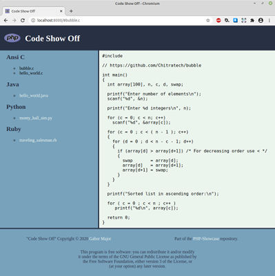
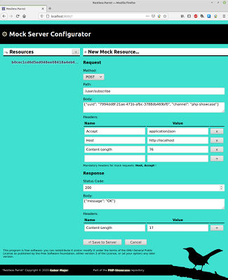
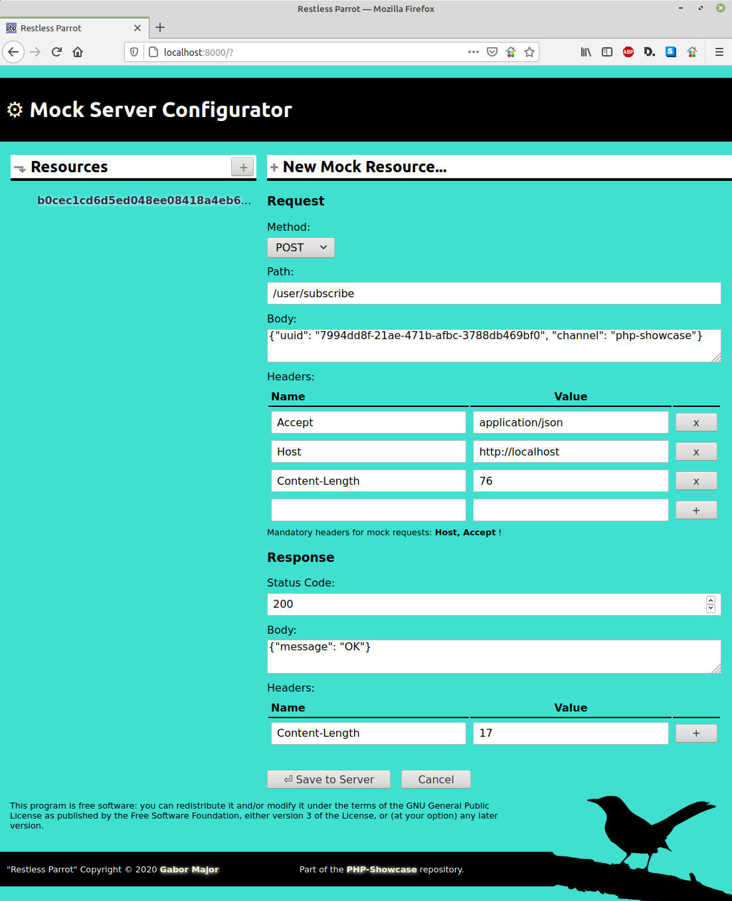

# php-showcase
KISS solutions to blatantly easy tasks with the right ratio of server and client side code.

## Contents

- [How to run a solution](#how-to-run-a-solution)
- [Solutions](#solutions)
  - [Code Show Off](#1-code-show-off)
  - [Search The News](#2-search-the-news)
  - [Restless Parrot](#3-restless-parrot)

## How to run a solution

To try out a solution in your browser:
1. Clone this respository
2. Install PHP until `php -v` reports the version number ;) Or just run the included script called 'setup'
3. Make sure 'php-showcase' is executable, then run it in the terminal
4. Pick a solution
5. Open a standards compliant browser and load "http://localhost:8000/"


Note: 'php-showcase' and 'setup' only supports Linux for the time being.

Pretty please: Open 'setup' and check what it actually does before you run it, because it may modify your system.

## Solutions

More solutions to come, depending on ideas/free time. Suggestions are welcome. Important to point out, that none of these are particularly elegant, or production level code, but it demonstrates what you can achieve with so little! This whole repository is just a nice distraction for me from the everyday crunch. I like a good challenge.

### Sneak Peek

<table>
  <tbody>
    <tr>
      <td><a href="#1-code-show-off"></a></td>
      <td><a href="#2-search-the-news"></a></td>                  
    </tr>
    <tr>
      <th><a href="#1-code-show-off">1) "Code Show Off"</a></th>
      <th><a href="#2-search-the-news">2) "Search The News"</a></th>                  
    </tr>
    <tr>
      <td colspan="2" style="text-align: center;"><a href="#3-restless-parrot"></a></td>                  
    </tr>
    <tr>
      <th colspan="2"><a href="#3-restless-parrot">3) "Restless Parrot"</a></th>                
    </tr>            
  </tbody>
</table>

### 1) Code Show Off

**⚑ Goal:** Showing off your juicy code snippets on a page.


**⊕ Requirements:**
- Only one index page.
- Very fast page load.
- Basic page layout: logo, title, navigation bar to choose the snippet from, footer.
- Displaying one snippet at a time, chosen by the user from the navigation bar.
- Caching contents (code snippets) on client side.
- SEO friendly
- Responsive design (mobile friendly)

**⊘ Restrictions** (derived from requirements):
- No frameworks used
- No database used
- Vanilla PHP & JavaScript, standards compliant HTML5 & CSS3

**⧗ Man-hours:** Approximately 5 hours.

**Total size:** 45,6 kB (includes sample content)

**⚒ Your challenge:**
- Make it nicer.
- Implement a textual and/or source type filter for the nav side bar.

**ℹ**  *To add a new snippet copy a source file to the "content" folder.*

**ℹ**  *If you wish to allow a certain source file extension, open docroot/index.php and add a new line to the ALLOWED_CONTENT const, e.g.:*

````
const ALLOWED_CONTENT = [
    'c' => 'Ansi C',
    'java' => 'Java',
    'py' => 'Python',
    'rb' => 'Ruby',
    'sh' => 'Shell Script' // << New stuff inserted here
];
````

[▲ Back to Contents](#contents)

### 2) Search The News

**⚑ Goal:** Let users search the latest and greatest of tech news, and deliver the results quickly with background caching and indexing.


**⊕ Requirements:**
- Only one index page.
- Fetching tech news from select RSS feeds.
- Caching and indexing news articles in the background.
- Type-ahead style and regular search results delivery.

**⊘ Restrictions (for the challenge):**
- No frameworks used
- No database used
- Vanilla PHP & JavaScript, standards compliant HTML5 & CSS3

**⧗ Man-hours:** Approximately 2 working days (or a weekend).

**Total size:** 123 kB

**⚒ Your challenge:**
- Refactor, refactor, refactor!
- There are very good, mature algos for this particular job. Learn them. You'll see that this implementation is very rudimentary (although it does a suprisingly good job).
- There are really nice indexers out there on packagist.org, however you'll need to tweak them as they are geared towards mysql, redis etc.
- Introduce strategies for the indexer, stemmer etc.
- Oh, and the feeder should really be a CRON job!

**ℹ**  *If you wish to add a new RSS feed source, open the Feeder.php source and add a new line to the const, e.g.:*

````
const RSS_FEEDS = [
    'https://www.techmeme.com/feed.xml?x=1',
    'https://feeds.feedburner.com/TechCrunch/',
    'https://www.technologyreview.com/topnews.rss',
    'http://feeds.arstechnica.com/arstechnica/technology-lab',
    'https://www.wired.com/feed/rss',
    'http://rss.nytimes.com/services/xml/rss/nyt/Technology.xml',
    'http://feeds.bbci.co.uk/news/technology/rss.xml'

    // << Insert a new URL here
];
````

**ℹ**  *To change how frequently the indexer should run, and for how long to keep news articles open the Feeder.php source and look for the following consts:*

````
const UPDATE_INTERVAL_SEC = 900; // 15 minutes
const PURGE_OLDER_THAN_SEC = 86400; // 1 day
````

[▲ Back to Contents](#contents)

### 3) Restless Parrot

**⚑ Goal:** Your trusty parrot is restless, so much so it learned how to reply to your requests. With a mock server, and a handy companion web UI for configuration, we can develop and test the frontend of any project without a working backend.



**⊕ Requirements:**
- Only one index page for configuring the mock server
- HTTP/1.1 compliant web server for mocking purposes
- Performant, OOP implementation

**⊘ Restrictions (for the challenge):**
- No frameworks used
- No database used
- Vanilla PHP & JavaScript, standards compliant HTML5 & CSS3

**⧗ Man-hours:** Approximately 3 working days (or a couple of late-night coding sessions).

**Total size:** 83.5 kB

**⚒ Your challenge:**
- Make the UI nicer.
- Try to optimise the controllers. Do we really need so many of them? Can we make it so, that each controller features multiple callable methods (not just index())?
- Write unit tests.
- Write a performance test for the hashing __toString() method, and prove it (see my comment what exactly).
- Write a string parser that works character-by-character and replace LineParser with it (just for practising, I doubt it would be that much more performant).
- Make the __construct() of Request class use more rigorous validation on the actual request data.
- Find ready to use mock servers. See how they've been done and compare them with this solution. Think about the pros and cons.
- Write the saved mock resources to disk periodically, and restore them on boot in the MockServer class.

**ℹ**  *Use the UI to register a couple of Request-Response pairs, then test it with JS or Postman or anything that can call the mock server via HTTP.*

**ℹ**  *You get the fastest reponses when you send the registered request verbatim. If the request method, path, body matches, and all the registered headers are present the mock server will still respond!*

**ℹ** *If the mock server cannot start with ./php-showcase wait a little until the port becomes free. As a last resort try "killall php" before running. If port 8010 on your machine is always in use replace the default port in MockServer.php (DEFAULT_PORT const) AND in main.js (MOCK_SERVER_URL const)*

[▲ Back to Contents](#contents)