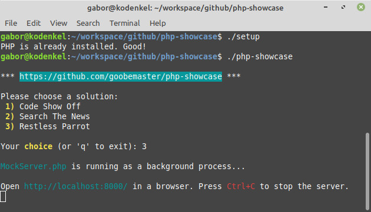

# php-showcase
KISS solutions to blatantly easy tasks with the right ratio of server and client side code.

To try out a solution in your browser:
1. Clone this respository
2. Install PHP until `php -v` reports the version number ;) Or just run the included script called 'setup'
3. Make sure 'php-showcase' is executable, then run it in the terminal
4. Pick a solution
5. Open a standards compliant browser and load "http://localhost:8000/"



Note: 'php-showcase' and 'setup' only supports Linux for the time being.

Pretty please: Open 'setup' and check what it actually does before you run it, because it may modify your system.

More solutions to come, depending on ideas/free time. Suggestions are welcome. Important to point out, that none of these are particularly elegant, or production level code, but it demonstrates what you can achieve with so little! This whole repository is just a nice distraction for me from the everyday crunch. I like a good challenge.

## 1) Code Show Off


Goal: Showing off your juicy code snippets on a page.

Requirements:
- Only one index page.
- Very fast page load.
- Basic page layout: logo, title, navigation bar to choose the snippet from, footer.
- Displaying one snippet at a time, chosen by the user from the navigation bar.
- Caching contents (code snippets) on client side.
- SEO friendly
- Responsive design (mobile friendly)

Restrictions (derived from requirements):
- No frameworks used
- No database used
- Vanilla PHP & JavaScript, standards compliant HTML5 & CSS3

Man-hours: Approximately 5 hours.

Total size: 45,6 kB (includes sample content)

Your challenge:
- Make it nicer.
- Implement a textual and/or source type filter for the nav side bar.

To add a new snippet copy a source file to the "content" folder.

If you wish to allow a certain source file extension, open docroot/index.php and add a new line to the ALLOWED_CONTENT const, e.g.:

````
const ALLOWED_CONTENT = [
    'c' => 'Ansi C',
    'java' => 'Java',
    'py' => 'Python',
    'rb' => 'Ruby',
    'sh' => 'Shell Script' // << New stuff inserted here
];
````

## 2) Search The News


Goal: Let users search the latest and greatest of tech news, and deliver the results quickly with background caching and indexing.

Requirements:
- Only one index page.
- Fetching tech news from select RSS feeds.
- Caching and indexing news articles in the background.
- Type-ahead style and regular search results delivery.

Restrictions (for the challenge):
- No frameworks used
- No database used
- Vanilla PHP & JavaScript, standards compliant HTML5 & CSS3

Man-hours: Approximately 2 working days (or a weekend).

Total size: 123 kB

Your challenge:
- Refactor, refactor, refactor!
- There are very good, mature algos for this particular job. Learn them. You'll see that this implementation is very rudimentary (although it does a suprisingly good job).
- There are really nice indexers out there on packagist.org, however you'll need to tweak them as they are geared towards mysql, redis etc.
- Introduce strategies for the indexer, stemmer etc.
- Oh, and the feeder should really be a CRON job!

If you wish to add a new RSS feed source, open the Feeder.php source and add a new line to the const, e.g.:

````
const RSS_FEEDS = [
    'https://www.techmeme.com/feed.xml?x=1',
    'https://feeds.feedburner.com/TechCrunch/',
    'https://www.technologyreview.com/topnews.rss',
    'http://feeds.arstechnica.com/arstechnica/technology-lab',
    'https://www.wired.com/feed/rss',
    'http://rss.nytimes.com/services/xml/rss/nyt/Technology.xml',
    'http://feeds.bbci.co.uk/news/technology/rss.xml'

    // << Insert a new URL here
];
````

To change how frequently the indexer should run, and for how long to keep news articles open the Feeder.php source and look for the following consts:

````
const UPDATE_INTERVAL_SEC = 900; // 15 minutes
const PURGE_OLDER_THAN_SEC = 86400; // 1 day
````